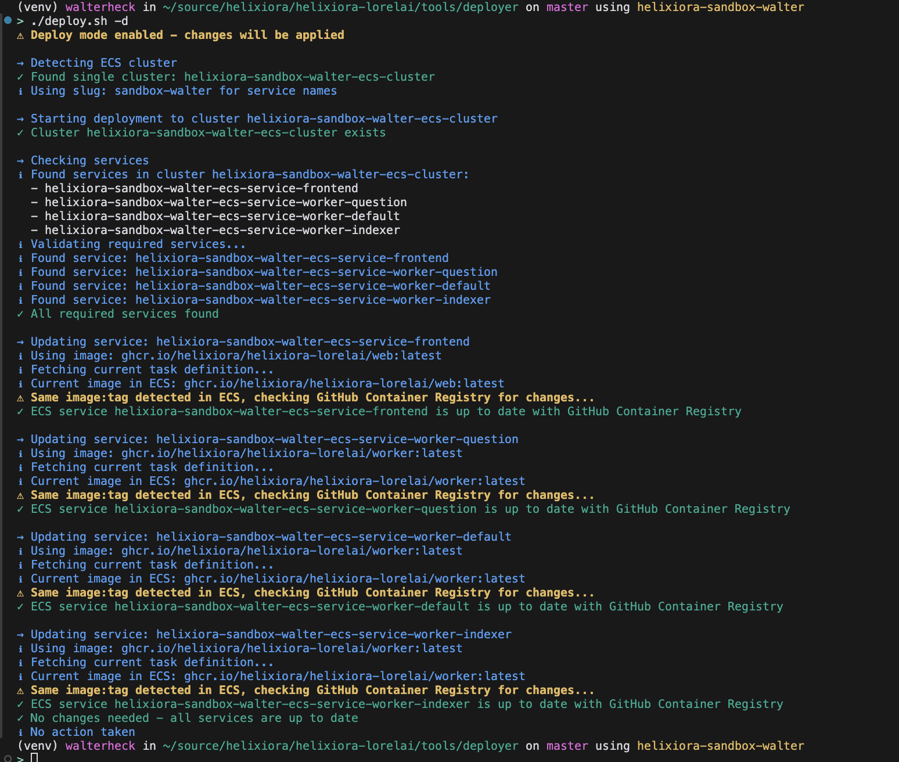

# ECS Deployment Tool

This tool deploys Lorelai. It uses containers from GitHub Container Registry to an ECS cluster. It
supports both web and worker containers and includes safety features like dry-run mode and image SHA
verification.

## Important Notes

### Environment Prerequisites

This tool expects an existing Lorelai environment, which should be created using
[helixiora/helixiora-terraform](https://github.com/helixiora/helixiora-terraform) first. Without a
properly set up environment, this tool will not work.

### Limitations

This tool is **only** for deploying new container image versions to an existing environment. It does
NOT:

- Create or modify infrastructure
- Apply database schema changes
- Update environment variables or configuration
- Modify any AWS resources beyond ECS task definitions and services

For infrastructure changes, database migrations, or environment setup, please use the appropriate
tools:

- Infrastructure changes: Use helixiora-terraform
- Database migrations: Use the migration tools in the main Lorelai application
- Environment configuration: Update through terraform or AWS console

## Prerequisites

- AWS CLI installed and configured with appropriate permissions
- `jq` command-line tool installed
- GitHub Personal Access Token with `read:packages` scope
- Bash shell
- Access to the GitHub Container Registry (ghcr.io)
- Access to the ECS cluster

### Required AWS Permissions

The AWS credentials need the following permissions:

- `ecs:DescribeClusters`
- `ecs:ListServices`
- `ecs:DescribeTaskDefinition`
- `ecs:RegisterTaskDefinition`
- `ecs:UpdateService`

## Setup

1. Install dependencies:

   ```bash
   # macOS
   brew install jq awscli

   # Ubuntu/Debian
   apt-get install jq awscli
   ```

1. Configure AWS credentials:

   ```bash
   aws configure
   # Or use AWS SSO/environment variables
   ```

1. Set up GitHub token:

   ```bash
   export GITHUB_TOKEN=your_github_token
   ```

## Usage

The script supports both dry-run (default) and deploy modes.

### Basic Usage

```bash
# Dry run (no changes made)
./deploy.sh

# Actually deploy changes
./deploy.sh -d

# Deploy specific tag
./deploy.sh -d -t v1.0.0

# Deploy to specific cluster
./deploy.sh -d -c my-cluster-name
```

### All Options

```bash
Usage: ./deploy.sh [options]
Options:
  -i, --image <name>     Docker image name (defaults to ghcr.io/helixiora/helixiora-lorelai/web
                            for frontend, /worker for workers)
  -t, --tag <tag>        Docker image tag (default: latest)
  -c, --cluster <name>   ECS cluster name (auto-detected if only one exists)
  -d, --deploy           Disable dry-run mode and actually deploy (default: dry-run enabled)
  -h, --help            Show this help message
```

## Expectations

### Cluster Structure

The tool expects an ECS cluster with exactly 4 services:

- Frontend service: `helixiora-{cluster-slug}-ecs-service-frontend`
- Worker services:
  - `helixiora-{cluster-slug}-ecs-service-worker-question`
  - `helixiora-{cluster-slug}-ecs-service-worker-default`
  - `helixiora-{cluster-slug}-ecs-service-worker-indexer`

### Container Images

- Frontend uses: `ghcr.io/helixiora/helixiora-lorelai/web`
- Workers use: `ghcr.io/helixiora/helixiora-lorelai/worker`

### Safety Features

1. **Dry Run Mode**

   - Enabled by default
   - Shows what changes would be made without making them
   - Use `-d` to actually apply changes

1. **Image SHA Verification**

   - Checks if the image has actually changed before updating
   - Caches results to avoid redundant GitHub API calls
   - Shows available tags if requested tag not found

1. **Service Validation**

   - Verifies all required services exist
   - Checks service naming conventions
   - Validates cluster exists before proceeding

## Output

The tool provides clear, color-coded output indicating:

- ✓ Success messages (green)
- ℹ Info messages (blue)
- ⚠ Warnings and dry-run messages (yellow)
- ✗ Errors (red)

### Example Output



## Error Handling

The script will exit with an error if:

- Required services are missing
- Cluster doesn't exist
- AWS permissions are insufficient
- GitHub token is missing when needed
- Service count doesn't match expectations
